# 🫀 Heart Disease Risk Prediction System

**AI-powered clinical decision support for heart disease risk assessment using machine learning explainability**

[](https://www.python.org/)
[](https://scikit-learn.org/)
[](https://catboost.ai/)
[](https://shap.readthedocs.io/)
[](https://streamlit.io/)

---

## 📋 Project Overview

This end-to-end machine learning project predicts heart disease risk from 12 clinical features using an ensemble of 5 optimized models. The system includes comprehensive exploratory data analysis, hyperparameter tuning with Optuna, SHAP-based feature importance, and an interactive Streamlit web application for clinical decision support.

### 🎯 Use Case
Healthcare providers need rapid, accurate heart disease risk stratification to prioritize patients for preventive interventions. This system combines predictive accuracy (93.77% ROC-AUC) with interpretability to support clinical decision-making.

---

## 📊 Dataset Overview

- **Source**: UCI Heart Failure Prediction Dataset (Kaggle)
- **Samples**: 918 patients
- **Features**: 12 clinical variables
- **Target**: Binary (Disease/No Disease)
- **Class Balance**: 410 healthy (44.7%), 508 disease (55.3%)

### Clinical Features
```
Demographics:     Age, Sex
Vital Signs:      RestingBP, MaxHR, Cholesterol
ECG:              RestingECG, Oldpeak, ST_Slope
Symptoms:         ChestPainType, ExerciseAngina
Blood Tests:      FastingBS
```

---

## 🏗️ System Architecture

```mermaid
graph LR
    A[Raw Data<br/>CSV] -->|Load| B[Data Cleaning<br/>Missing Values]
    B -->|Explore| C[EDA<br/>18+ Functions]
    C -->|Split| D[Train/Test<br/>80/20 Stratified]
    D -->|Preprocess| E[StandardScaler<br/>OneHotEncoder]
    E -->|Train| F["5-Model Ensemble<br/>(LR, RF, XGB, LGBM, CB)"]
    F -->|Optimize| G["Optuna Tuning<br/>(50 trials)"]
    G -->|Evaluate| H["Metrics & ROC<br/>(6 plots)"]
    H -->|Explain| I["SHAP Analysis<br/>(Feature Importance)"]
    I -->|Deploy| J["Streamlit App<br/>(3-tab UI)"]
    J -->|Predict| K["Risk Score<br/>Confidence Gauge"]
```



---

## 🚀 Quick Start

### Installation

```bash
# Clone repository
git clone https://github.com/invincible1786/Heart-Disease-Prediction.git
cd Heart-Disease-Prediction

# Create Python environment
python -m venv .venv
.venv\Scripts\activate  # On Windows
# source .venv/bin/activate  # On macOS/Linux

# Install dependencies
pip install -r requirements.txt
```

### Run Analysis & Training

```bash
# Execute EDA notebook
jupyter notebook notebooks/01_Exploratory_Data_Analysis.ipynb

# Train all models with tuning
jupyter notebook notebooks/02_Full_Model_Comparison_and_Evaluation.ipynb
```

### Launch Web Application

```bash
streamlit run app/streamlit_app.py
```
Opens at `http://localhost:8501`

---

## 📈 Model Performance

### Best Model: CatBoost Classifier

| Metric | Score |
|--------|-------|
| **Accuracy** | 89.13% |
| **Precision** | 90.20% |
| **Recall (Sensitivity)** | 90.20% |
| **F1-Score** | 90.20% |
| **ROC-AUC** | **93.77%** ⭐ |

### 5-Model Comparison

| Model | Accuracy | Precision | Recall | F1-Score | ROC-AUC |
|-------|----------|-----------|--------|----------|---------|
| **CatBoost** | 0.8913 | 0.9020 | 0.9020 | 0.9020 | **0.9377** |
| LogisticRegression | 0.8696 | 0.8673 | 0.8966 | 0.9005 | 0.9366 |
| RandomForest | 0.8533 | 0.8723 | 0.8505 | 0.8835 | 0.9247 |
| XGBoost | 0.8370 | 0.8511 | 0.8261 | 0.8571 | 0.9191 |
| LightGBM | 0.8261 | 0.8485 | 0.8046 | 0.8456 | 0.9157 |

---

## 🔍 Project Structure

```
Heart-Disease-Prediction/
│
├── data/
│   ├── raw/
│   │   └── heart.csv                 # Original dataset (918 x 12)
│   └── processed/
│       └── [processed data files]
│
├── notebooks/
│   ├── 01_Exploratory_Data_Analysis.ipynb
│   │   └── 18+ visualizations: distributions, correlations, outliers
│   └── 02_Full_Model_Comparison_and_Evaluation.ipynb
│       └── Training pipeline, hyperparameter tuning, SHAP analysis
│
├── src/
│   ├── models/
│   │   ├── train_model.py            # 5-model ensemble + Optuna tuning
│   │   └── predict.py                # Inference API + preprocessing
│   └── visualization/
│       ├── plots.py                  # 15+ EDA + 4 evaluation functions
│       └── PLOTTING_FUNCTIONS.md     # API documentation
│
├── app/
│   ├── streamlit_app.py              # Web dashboard (Predict/Performance/About tabs)
│   └── README.md                     # App usage guide
│
├── results/
│   ├── models/
│   │   ├── best_model.joblib         # Trained CatBoost (93.77% ROC-AUC)
│   │   ├── preprocessor.joblib       # sklearn Pipeline
│   │   └── metadata.json             # Hyperparameters + SHAP importance
│   ├── figures/
│   │   ├── model_comparison.png      # 6-panel metrics dashboard
│   │   ├── shap_summary.png          # Feature importance
│   │   ├── confusion_matrix.png      # Sensitivity/Specificity
│   │   └── roc_curves.png            # Multi-model ROC overlay
│   └── model_comparison.csv          # Performance metrics table
│
├── requirements.txt                  # Python dependencies
└── README.md                         # This file
```

---

## 🛠️ Tech Stack

| Component | Technology | Purpose |
|-----------|-----------|---------|
| **ML Framework** | scikit-learn 1.0+ | Data preprocessing, metrics, model APIs |
| **Models** | CatBoost, LightGBM, XGBoost, Random Forest | Gradient boosting & ensemble algorithms |
| **Hyperparameter Tuning** | Optuna | Bayesian optimization (50 trials, TPESampler) |
| **Explainability** | SHAP 0.41+ | Feature importance & model interpretability |
| **Visualization** | Matplotlib, Seaborn, Plotly | 18+ EDA plots + interactive dashboards |
| **Web Framework** | Streamlit | Interactive clinical decision support app |
| **Development** | Python 3.9+, Jupyter | Notebooks for exploratory analysis |

---

## 🎯 Key Features

✅ **Comprehensive EDA**
- 18+ visualization functions covering distributions, correlations, outliers, data quality
- Missing value detection & handling
- Feature engineering exploration

✅ **5-Model Ensemble**
- CatBoost (best: 93.77% ROC-AUC)
- LightGBM, XGBoost, Random Forest, Logistic Regression
- Stratified K-fold cross-validation (5-fold, seed=42)

✅ **Advanced Optimization**
- Optuna hyperparameter tuning (50 trials per model)
- TPE sampler for efficient search
- Reproducible random_state=42 throughout

✅ **Model Explainability**
- SHAP TreeExplainer for boosting models
- SHAP KernelExplainer for others
- Waterfall plots for individual predictions
- Feature importance rankings (top 10)

✅ **Interactive Web App**
- Patient risk assessment dashboard
- 12-feature input form with clinical guidance
- Probability gauge with risk stratification
- Model performance comparison
- Feature importance visualization
- Cached resource loading for 90MB+ artifacts

✅ **Production-Ready**
- Artifact persistence: model + preprocessor + metadata
- Deterministic training (seed=42)
- Error handling & graceful fallbacks
- Inference API for single patient predictions

---

## 📖 Usage Examples

### 1. Train Models (Jupyter Notebook)

```python
from src.models.train_model import train_all_models

# Trains all 5 models with Optuna tuning
best_model, results_df = train_all_models(
    X_train, y_train, X_val, y_val,
    n_trials=50
)
# Returns CatBoost model + performance metrics
```

### 2. Make Predictions

```python
from src.models.predict import predict_single_patient

patient = {
    'Age': 55,
    'Sex': 'M',
    'ChestPainType': 'TA',
    'RestingBP': 130,
    'Cholesterol': 200,
    'FastingBS': 0,
    'RestingECG': 'Normal',
    'MaxHR': 150,
    'ExerciseAngina': 'N',
    'Oldpeak': 1.5,
    'ST_Slope': 'Up'
}

result = predict_single_patient(patient)
# {'prediction': 0, 'probability': 0.25, 'risk_level': 'Low'}
```

### 3. Generate Visualizations

```python
from src.visualization.plots import plot_model_comparison, plot_roc_curves

# 6-panel metrics dashboard (300 DPI, timestamped)
plot_model_comparison(results_df)

# Multi-model ROC curves
plot_roc_curves(models_dict, X_test, y_test, preprocessor)
```

### 4. Launch Web App

```bash
streamlit run app/streamlit_app.py
```

Features:
- **Predict Tab**: Enter 12 clinical features → get risk score + clinical notes
- **Performance Tab**: Metrics comparison + ROC-AUC rankings
- **About Tab**: Model architecture + SHAP feature rankings + tech stack

---

## 📊 Hyperparameter Optimization

**Optuna Configuration:**
- Framework: Optuna 3.0+
- Sampler: TPE (Tree-structured Parzen Estimator)
- Trials per model: 50
- Seed: 42 (reproducible)
- Metric: F1-score (prioritizes recall & precision balance)

**Example CatBoost Hyperparameters Found:**
```python
{
    'iterations': 200,
    'learning_rate': 0.08,
    'max_depth': 7,
    'l2_leaf_reg': 5.0,
    'subsample': 0.95,
    'colsample_bylevel': 0.85
}
```

---

## 🔍 SHAP Feature Importance

**Top 10 Predictive Features:**
1. Oldpeak (ST segment depression) - 0.0856
2. MaxHR (maximum heart rate) - 0.0723
3. RestingBP (resting blood pressure) - 0.0612
4. Age - 0.0578
5. Cholesterol - 0.0501
6. (Other 5 features...) - 0.0381 avg

---

## 🚨 Clinical Disclaimer

⚠️ **For Educational & Research Purposes Only**

This application is **NOT** a substitute for professional medical diagnosis or treatment. Always consult qualified healthcare professionals for medical decisions.

---

## 📚 Notebooks

### 01_Exploratory_Data_Analysis.ipynb
- Dataset overview & quality assessment
- Missing value analysis
- Feature distributions & statistical summaries
- Correlation heatmaps
- Outlier detection
- Age & sex demographic analysis
- Disease prevalence by subgroups

### 02_Full_Model_Comparison_and_Evaluation.ipynb
- Data preprocessing pipeline (StandardScaler, OneHotEncoder)
- Stratified train/test split (80/20)
- 5-model training with sklearn Pipeline
- Optuna hyperparameter tuning (50 trials)
- Cross-validation metrics
- SHAP feature importance analysis
- Model comparison: ROC curves, confusion matrices
- Results visualization (6 plots with 300 DPI)
- Artifact persistence: model, preprocessor, metadata

---

## 🔄 Workflow

```
1. Load Data
   └─ 918 patients × 12 features

2. Exploratory Analysis
   └─ 18+ visualizations → identify patterns

3. Preprocessing
   ├─ StandardScaler (numeric)
   └─ OneHotEncoder (categorical)

4. Train/Validation Split
   └─ Stratified 80/20 with seed=42

5. Model Training
   ├─ LogisticRegression
   ├─ RandomForest
   ├─ XGBoost
   ├─ LightGBM
   └─ CatBoost

6. Hyperparameter Optimization
   └─ Optuna (50 trials, TPE sampler, F1 metric)

7. Evaluation
   ├─ Cross-validation metrics
   ├─ ROC-AUC ranking
   └─ Generate 6 comparison plots

8. Explainability
   └─ SHAP feature importance (waterfall plots)

9. Deployment
   └─ Save model + preprocessor + metadata

10. Web Application
    └─ Streamlit dashboard (Predict/Performance/About)
```

---

## 🎓 Learning Outcomes

After this project, you'll understand:
- ✅ End-to-end ML pipeline (EDA → preprocessing → training → evaluation → deployment)
- ✅ 5-model ensemble comparison & hyperparameter tuning with Optuna
- ✅ SHAP-based model explainability for clinical applications
- ✅ Scikit-learn preprocessing pipelines & cross-validation
- ✅ Production-ready code: artifact persistence, error handling, reproducibility
- ✅ Interactive web app development with Streamlit
- ✅ Professional visualization: 18+ plots with industry standards

---

## 🚀 Future Enhancements

- [ ] **Ensemble Methods**: Stacking/voting across models
- [ ] **FastAPI Backend**: REST API for production deployment
- [ ] **Advanced SHAP Plots**: Dependence plots, force plots, interaction analysis
- [ ] **Patient Monitoring**: Track risk over time
- [ ] **Mobile App**: React Native/Flutter frontend
- [ ] **Continuous Retraining**: Auto-pipeline with new data
- [ ] **Model Registry**: MLflow for version control
- [ ] **A/B Testing**: Compare model versions in production
- [ ] **Fairness Analysis**: Bias detection across demographics
- [ ] **Containerization**: Docker + Kubernetes deployment

---

## 📦 Dependencies

See `requirements.txt` for full list:
```
pandas>=1.3.0
numpy>=1.21.0
scikit-learn>=1.0.0
matplotlib>=3.4.0
seaborn>=0.11.0
optuna>=3.0.0
catboost>=1.0.0
lightgbm>=3.3.0
xgboost>=1.5.0
shap>=0.41.0
streamlit>=1.15.0
plotly>=5.0.0
joblib>=1.1.0
```

---

## ⚙️ Configuration

**Reproducibility Settings:**
- Random Seed: 42 (everywhere)
- Train/Test Split: 80/20 (stratified)
- Cross-Validation: 5-fold (stratified)
- Test Size: 25% of training data
- Hyperparameter Trials: 50 per model
- Optimization Metric: F1-score

---

## 📞 Support & Contact

- **GitHub Issues**: Report bugs or request features
- **Discussions**: Share ideas or ask questions
- **Email**: Contact project owner for collaborations

---

## 📄 License

This project is provided for educational and research purposes. Clinical applications require proper validation and regulatory compliance.

---

## 🙏 Acknowledgments

- **Dataset**: UCI Heart Failure Prediction Dataset (Kaggle)
- **Libraries**: scikit-learn, CatBoost, SHAP, Streamlit teams
- **Inspiration**: Healthcare AI best practices & ML interpretability research

---

## 📊 Citation

If you use this project in research:

```bibtex
@misc{HeartDiseasePrediction2026,
  author = {Ruhaan Kakar},
  title = {Heart Disease Risk Prediction: End-to-End ML with SHAP Explainability},
  year = {2026},
  url = {https://github.com/invincible1786/Heart-Disease-Prediction}
}
```

---

<div align="center">

**Built with ❤️ for Healthcare AI**

*Combining predictive accuracy with interpretability for clinical decision support*

[◀ Back to Top](#-heart-disease-risk-prediction-system)

</div>
